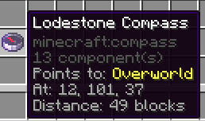
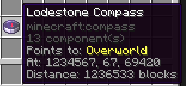
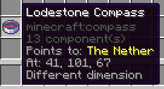
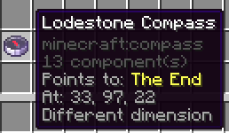
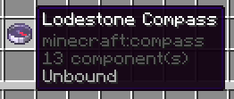

# Lodestone Compass Locator

Shows the location that a lodestone compass is bound to in the item tooltip.

## Preview







## Features

- Shows the **dimension** the compass is bound to, including modded dimensions.
- Shows the **X, Y, Z** coordinates of the lodestone.
- Shows **distance** in blocks when you're in the same dimension.
- Flags when the compass points to a different dimension.
- Marks compasses that don't point anywhere as "Unbound".

## How to use

1. Bind a compass to a lodestone (right-click the lodestone with the compass), or pick up a compass that someone else bound.
2. Hover over the compass in your inventory.
3. Read the tooltip. That's it — no config, no commands.

## Supported versions

Works on every stable Minecraft release from **1.21 to 26.2**:

| Minecraft | Loader | Java |
|-----------|--------|------|
| 1.21, 1.21.1, 1.21.2, 1.21.3, 1.21.4, 1.21.5, 1.21.6, 1.21.7, 1.21.8, 1.21.9, 1.21.10, 1.21.11 | Fabric | 21 |
| 26.1, 26.1.1, 26.1.2, 26.2 | Fabric | 25 |

Each version has its own build, available in the [Releases](https://github.com/xwvi/lodestonefinder/releases) tab.

## Installation

1. Install [Fabric Loader](https://fabricmc.net/use/) for your Minecraft version.
2. Download the jar for your Minecraft version from [Releases](https://github.com/xwvi/lodestonefinder/releases).
3. Drop it into your `.minecraft/mods` folder.
4. Also install [Fabric API](https://modrinth.com/mod/fabric-api).

## Requirements

- Minecraft Java Edition (1.21 through 26.2)
- Fabric Loader 0.16+
- Fabric API

## Compatibility

This is a **client-side** mod. It works on vanilla and modded servers, and can be installed on a client without anything server-side. Safe to remove at any time.

## Building from source

```bash
# Build for the default version (26.2)
./gradlew build

# Build for a specific version
./gradlew build -Pmc_version=1.21.8

# Build every supported version at once
for v in 1.21 1.21.1 1.21.2 1.21.3 1.21.4 1.21.5 1.21.6 1.21.7 1.21.8 1.21.9 1.21.10 1.21.11 26.1 26.1.1 26.1.2 26.2; do
  ./gradlew build -Pmc_version=$v
done
```

Per-version dependency versions live in `gradle/versions/`. Releases are built automatically by GitHub Actions whenever a `v*` tag is pushed.

## License

[MIT](LICENSE)
